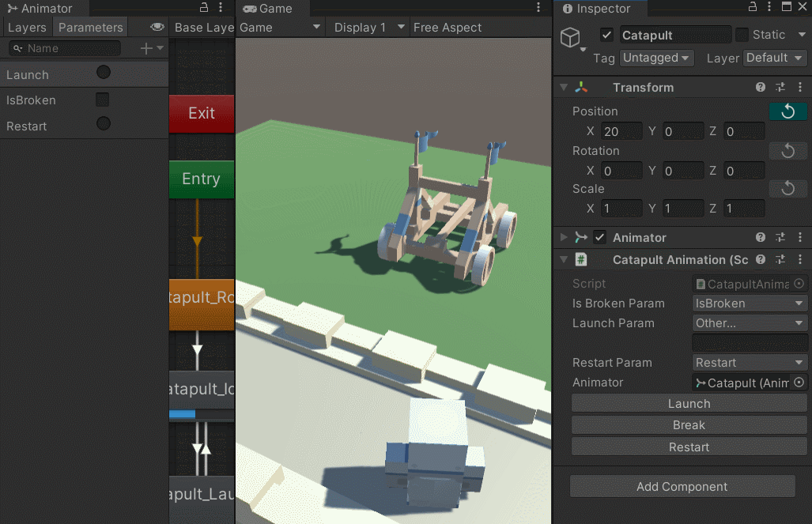
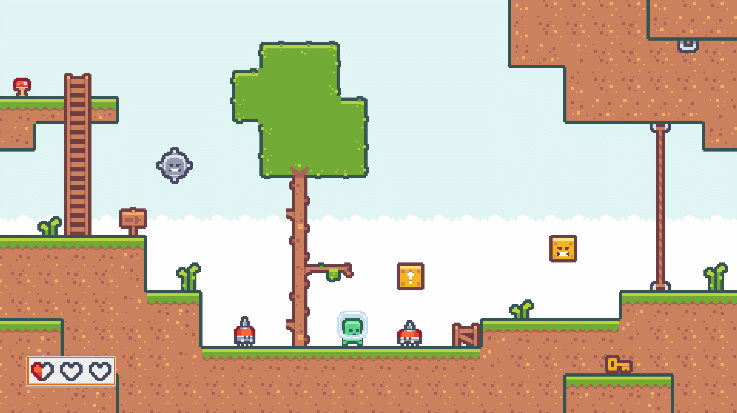
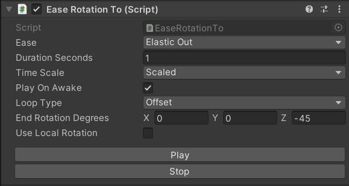
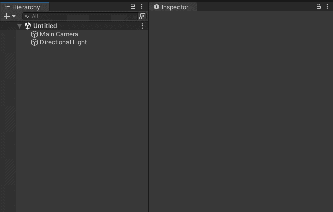
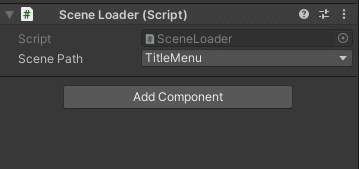

# Atlas 👩‍🚀 
[](https://github.com/david-knopp/Atlas/releases/latest)  [](https://github.com/david-knopp/Atlas/blob/master/LICENSE) [](https://github.com/david-knopp/Atlas/releases/latest)

> A C# utility and helper library for Unity.

---
Check out the [documentation](https://david-knopp.github.io/Atlas/index.html "documentation") for a more detailed api reference and guides.

## Summary
Atlas is a library of reusable classes and tools designed to jump-start your Unity project by providing solutions for common tasks, and extending/augmenting the features of Unity and C#.

## Feature Preview

### Animation Parameter Helpers
Structs for each of the `Animator` parameter types that show a dropdown of options in the inspector. They show parameters for any `Animator`s serialized with the class, as well as any `Animator`s in children and parent components. As an added benefit, they automatically cache the parameter hash for that extra bit of performance at runtime.

```c#
public class CatapultAnimation : MonoBehaviour
{
    [SerializeField]
    private Animator m_animator;

    [SerializeField]
    private AnimatorTriggerHandle m_launchParam = "Launch";

    [InspectorButton]
    public void Launch()
    {
        m_animator.SetTrigger( m_launchParam );
    }
} 
```



### Easing
Several classes and functions based around [Robert Penner's easing functions]("http://robertpenner.com/easing/") for adding quick procedural animation. The `Ease` object gives dropdown options in the inspector with eases such as quadratic, bounce, elastic, etc., and functions to make interpolation easy. There are also several `EaseComponent`s that can be added to any object to add motion without writing code.

```c#
public sealed class EaseRotation : MonoBehaviour
{
    [SerializeField]
    private Vector3 m_startRotation;

    [SerializeField]
    private Vector3 m_endRotation;

    [SerializeField]
    private Ease m_ease;

    private void Update()
    {
        // get normalized time on [0, 1], wrapping every 2 seconds
        float t = ( Time.time % 2f ) / 2f;

        // ease between rotations
        transform.rotation = m_ease.Interpolate( Quaternion.Euler( m_startRotation ),
                                                 Quaternion.Euler( m_endRotation ),
                                                 t );
    }
}
```



> All motion in this example is done using the various Transform `EaseComponent`s, e.g. `EaseRotationTo`:



### Time Scale Editor Window
An editor window that allows manipulating Unity's `Time.timeScale` at runtime. It's great for speeding up (or slowing down) gameplay when debugging.


### Inspector Buttons
Easily add buttons that call `MonoBehaviour` methods by adding the `[InspectorButton]` attribute to them.


### Transform Reset Buttons
Reset `Transform` values to default with a button press.



### Swizzles
C# swizzling for `Vector2`, `Vector3`, `Vector4`, `Vector2Int`, `Vector3Int`, and `Color`.

```c#
public class SwizzleMeTimbers : MonoBehaviour
{
    public void Start()
    {
        // Creates a 2-dimensional vector with world X and Z
        Vector2 flatPos2D = transform.position.XZ();

        // Creates a 3-dimensional vector with (x, 0, y) values
        Vector3 flatPos3D = flatPos2D.X_Y();

        // Creates a color with the red and blue channels swapped,
        // and the alpha set to 0
        Color color = Color.magenta.BGR_();
    }
}
```

### Timer
An object for measuring elapsed time based off of Unity's timestep, configurable for Scaled, Unscaled, and Fixed time scales.

```c#
private IEnumerator LerpPositionToRoutine( Vector3 targetPosition, float lerpTimeSeconds )
{
    // start timer
    Timer timer = new Timer();
    timer.Start();

    Vector3 startPosition = transform.position;

    // interpolate to target position for given amount of time
    while ( timer.HasElapsed( lerpTimeSeconds ) == false )
    {
        // normalizes Timer's elapsed time to [0, 1]
        float t = timer.GetElapsedPercent( lerpTimeSeconds );
        transform.position = Vector3.Lerp( startPosition, targetPosition, t );

        yield return null;
    }
}
```

### Range
A serializable struct giving mininum and maximum float values, and providing several functions for common uses, such as checking if a value is within the range, getting a random value, clamping a value, etc. Also comes in an `int` variety.

```c#
public sealed class DamageComponent : MonoBehaviour
{
    [SerializeField]
    private Range m_damageRange = new Range( 6f, 20f );

    public void OnCharacterHit( Character hitCharacter )
    {
        // get randomized damage amount
        float damageAmount = m_damageRange.GetRandomValue();

        hitCharacter.ApplyDamage( damageAmount );
    }
}
```

### Scene Path Dropdown
Display a dropdown for all scenes in the project, or with an optional filter or folders to search in. A default scene folder path can also be set in the Atlas preferences under Edit->Preferences->Atlas->[ScenePath] Settings.

```c#
[SerializeField, ScenePath]
private string m_scenePath;

public void LoadScene()
{
    SceneManager.LoadScene( m_scenePath );
}
```



### Key-Value Pair Deconstruction
Easily break keys apart from values when iterating a `Dictionary`.

```c#
public class CharacterDatabase
{
    public void IterateCharacters()
    {
        // with key-value pair deconstruction
        foreach ( ( int id, Character character ) in m_characters )
        {
            // ...
        }

        // without
        foreach ( var kvp in m_characters )
        {
            int id = kvp.Key;
            Character character = kvp.Value;
        }
    }
    
    private readonly Dictionary<int, Character> m_characters =
        new Dictionary<int, Character>();
}
```

### Singleton
An implementation of the Singleton design pattern that helps ensure only 1 instance of the given class exists, and caches a shared instance by searching existing objects, or by instantiating one if one hasn't yet been created.

```c#
// Singleton declaration
public sealed class AudioSystem : SingletonBehavior<AudioSystem>
{
    public void PlayAudioClip( AudioClip clip )
    {
        // Audio playback code...
    }
}

// Accessing the singleton
public sealed class MatchAudio
{
    // called when a goal is scored
    public void OnGoalScored()
    {
        // play audio using shared AudioSystem instance
        AudioSystem.Instance.PlayAudioClip( AudioClip.GoalScored );
    }
}
```

## Installation

Atlas is a small library and doesn't rely on any external dependencies (outside of Unity itself), so installation should be relatively simple. Below are a couple of different ways to get Atlas up and running in your project:

#### Import using the Package Manager (Unity 2019.1+) 
Add `"com.davidknopp.atlas": "https://github.com/david-knopp/Atlas.git#ReleasePackage",` under the `"dependencies"` section of your project's manifest.json file, which should be located under the "Packages" folder in your project's root directory. Upon running Unity, Atlas should then be
downloaded automatically.

Note: to use this method, Git must be installed on the user machine and the Git executable path should be listed in the PATH system environment variable as explained [on the Unity forum](https://forum.unity.com/threads/git-support-on-package-manager.573673/ "Package Manager Git support - Unity Forum").

#### Import the Unity Package
Download the latest .unitypackage from the [releases page](https://github.com/david-knopp/Atlas/releases "releases page"). Then, simply drag and drop the [package](https://docs.unity3d.com/Manual/AssetPackages.html "package") into your Unity project.  

In an effort to keep your project tidy, Atlas will place itself in `Assets/ThirdParty/Atlas/`, but can be moved freely afterward, as nothing within the library depends upon this directory.

#### Copy/paste the source folders
Download or clone the latest master branch, then copy the assets contained at `Assets/Scripts/` of the Atlas project into your Unity project.

#### Mix & Match
Many of the files & classes contained within Atlas are modular and can be used on their own without any other dependencies. Therefore, individual files can be taken at will from the repository for use within your Unity projects.

## License
[MIT © David Knopp](https://github.com/david-knopp/Atlas/blob/master/LICENSE "MIT © David Knopp")
